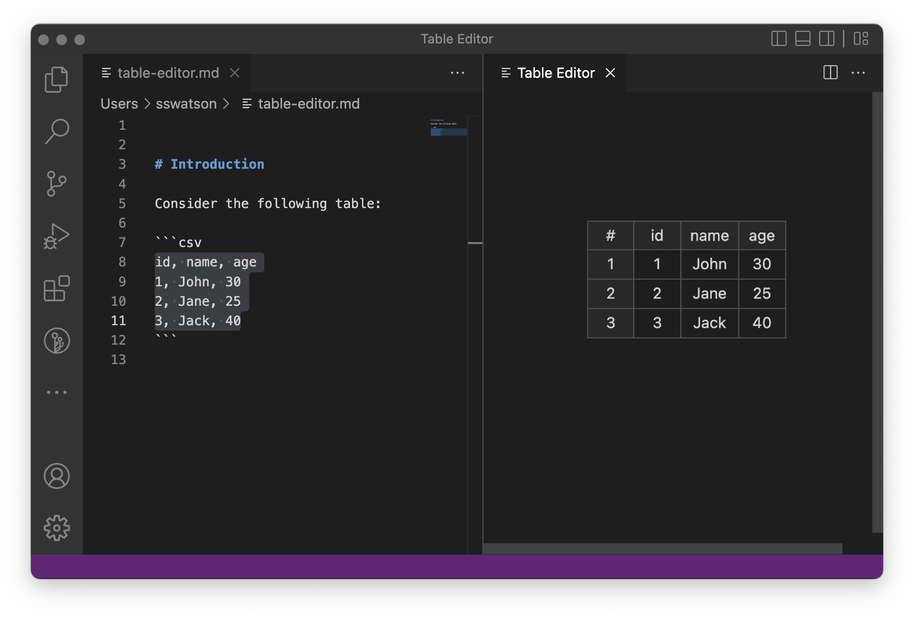

# Table Editor

This extension provides support for editing CSV files in a spreadsheet-like interface.



## Development

To build this project, do

```
pnpm install
pnpm build
```

To package the extension as a VSIX file to be installed in VS Code, do

```
pnpm package
```

To publish, do:

```
pnpm publish
```

## Installation

Search for "Table Editor" in the VS Code Extension Marketplace.

## Usage

See README in `extension` directory or in the Extenion Marketplace.