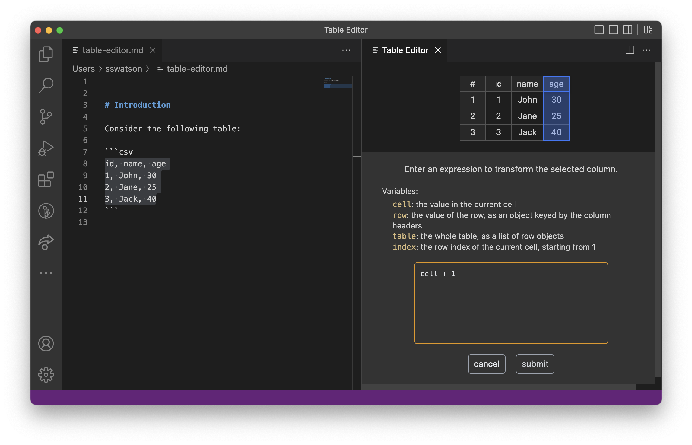

# Table Editor

This extension provides support for editing CSV, Markdown, HTML or JSON tables in a spreadsheet interface.


## Workflow

In any text file, select a block of text representing a CSV, Markdown, HTML, or JSON table and invoke the appropriate "Open in Table Editor" command using the command palette (for example, "Open CSV in Table Editor" if the format is CSV). 

The table will be displayed as a spreadsheet in a new tab. You can use the spreadsheet tool to add or delete rows or columns, change column order, edit the contents of cells, and more.

When you are done editing, you can save the table back to the original file by right-clicking on the table and and selecting "Insert Table as CSV" (or Markdown, HTML, or JSON). The new contents will replace whatever text is selected in the text editor.

## Spreadsheet Features

### Basics

To add or delete a column, click a column header and then right-click to bring up a menu with the options "Add Column Before", "Add Column After", and "Delete Column". You can change the order of columns by first clicking on a column header to select it and then drag-and-drop.

To add or delete rows, click on a row number and then right-click to bring up a menu with the options "Add Row Before", "Add Row After", "Delete Row", and "Add N Rows".

To autosize the column widths to the cell contents, right-click on any cell and select "Autofit Columns".

### Column transformations



The "Transform Column" feature in the column menu allows you to write code to transform the contents of a column. For example, to put quotation marks around the contents of each cell, you can submit this code:

```javascript
"\"" + value + "\""
```
The available variables are `cell`, `index`, `row`, and `table`.

The feature works by appending the code you supply to the text `(cell, index, row, table) => ` and then evaluating the resulting expression to obtain a (Javascript) function. This function is applied to each cell in the selected column or columns and the value returned by the function is used to replace the cell's contents.

The formula is not stored in the cell; if you need to edit your formula, do ⌘-Z or ctrl-Z to undo the transformation and select "Transform Column" again. The formula editor stores the history of formulas you've submitted during the current session.